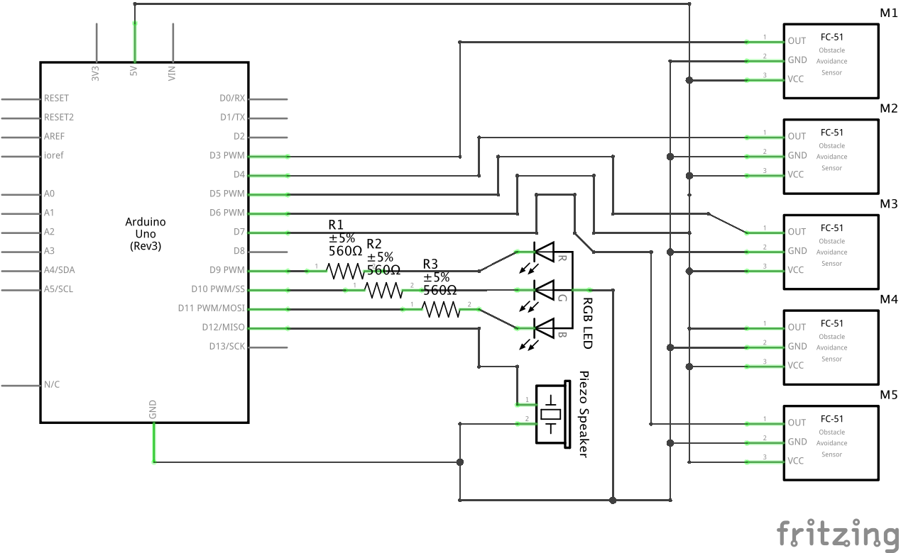
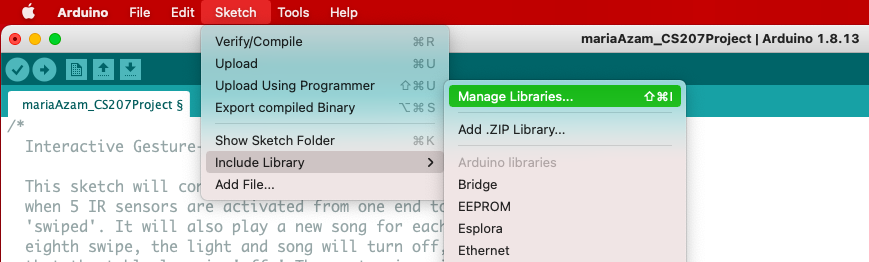
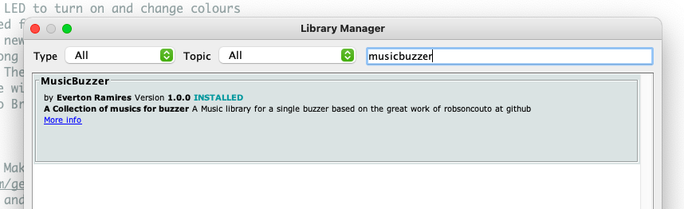

# CS207Project: Interactive Gesture-Controlled Table Light

## Table of Contents
1. Manifest
2. Features
3. Reproduction
4. Usage
5. Planned Features
6. Bugs
7. License
8. Credits

## Manifest
This repository contains the following items:
- [READme.md](README.md): The file you are currently reading, containing a detailed description of this project.
- [mariaAzam_CS207Project.ino](mariaAzam_CS207Project.ino): The Arduino source code for this project.
- [manageLibraries.png](manageLibraries.png): An image describing how to navigate to the `Manage Libraries` option in Arduino.
- [musicBuzzer.png](musicBuzzer.png): An image describing how to install the `MusicBuzzer` library in Arduino.
- [schematicDiagram.png](schematicDiagram.png): An image of the schematic diagram for the project's hardware circuit.

## Features
This project is loosely based on the Gesture-Controlled Interactive Table Light project by 'Random Stuff We Make' found at [hackster.io](https://www.hackster.io/rswm/gesture-controlled-interactive-table-light-3f8bd7#code). It also utilizes the `MusicBuzzer` library, initially written by Everton Ramires, and whose songs were included by robsoncouto on [github.com/robsoncouto/arduino-songs](https://github.com/robsoncouto/arduino-songs).

This project creates an interactive gesture-controlled table light. The table light features two main components: light and sound, and is composed of five IR Sensors, one RGB LED, and one piezo speaker. The table light is controlled by 'swiping' movements, the movement of a hand from right to left, detected by the IR Sensors. There is a series of 8 possible swipes of the hand, each swipe number corresponding to a different behaviour of the table light. Initially, the table light will be off. Once the first hand swipe is detected, the table light will turn on, indicated by a red LED and the 'Super Mario Bros' song playing from the piezo speaker. The second hand swipe will result in an orange LED and the 'The Lion Sleeps Tonight Song.' The colour of the LED and song will continue to change 5 more times, for a total of 7 different colours and songs. The eighth and final swipe will turn the table light off, indicated by no light in the RGB LED and no song playing rom the piezo speaker.

The following colours and songs are included in each swipe of the table light:
1. Red, 'Overworld Theme' - Super Mario Bros
2. Orange, 'The Lion Sleeps Tonight'
3. Yellow, 'Asa Branca' - Luiz Gonzaga
4. Green, 'Hedwig's Theme' - Harry Potter
5. Blue, 'Game of Thrones Theme' - Game of Thrones
6. Purple, 'Song of Storms' - Legend of Zelda Ocarina of Time
7. Pink, 'Pink Panther Theme' - Pink Panther
8. No colour, no music

For a more detailed visual and audial description of the project, please view the video here:
[INSERT YOUTUBE VIDEO LINK](YOUTUBE VIDEO LINK)

## Reproduction
In order to reproduce this project, you will need the following hardware components:
- 1 Arduino Uno (complete with a USB cable)
- Jumper Wires (at least 21)
- 5 IR Sensors (you may use more or less, or even an IR Sensor, array if you choose)
- 1 RGB LED
- 1 Piezo Speaker

To build the circuit, arrange the above-mentioned hardware components according to the following schematic diagram:

To build the software for this project, please complete the following steps:
- Download and open the Arduino software for your specific operating system. For specific download instructions and versions, please visit: [Arduino Software](https://www.arduino.cc/en/software).
- When you open Arduino, a new project will be created for you. Save it in your desired location on your device.
- You will see that a code template has been created for you. Delete this and add the required code for this project. Either copy/paste or download the following source code [mariaAzam_CS207Project.ino](mariaAzam_CS207Project.ino) into your `.ino` file.
- In order for the `music` functions to work, you will need to install the 'MusicBuzzer' library by [robsoncouto](https://github.com/robsoncouto/arduino-songs). To do so, please complete the following steps:
  - In the top toolbar of Arduino, select: `Sketch > Include Library > Manage Libraries`.
    
  - In the `Library Manager` dialog box, search for 'Music Buzzer'.
  - Select the `MusicBuzzer` library by Everton Ramires, and click `Install`.
    .
  - Save this library in your `Documents > Arduino > libraries` folder on your device.
  - Once the `MusicBuzzer` library has been installed, you need to add it to your project.
  - In the top toolbar of Arduino, select: `Sketch > Include Library > Add .ZIP Library...`.
  - Navigate to your `Documents > Arduino > libraries` folder, select `MusicBuzzer`, and press `Choose`.
  - Arduino will automatically add a `#include <MusicBuzzer.h>` statement at the top of your code. This is necessary, so do not alter or erase it.
  - Now the `MusicBuzzer` library has been included in your project, and you are ready to use its functions.
- Now you are ready to compile and upload the project by completing the following steps:
  - Make sure to save the your project.
  - Click the checkmark icon in the top-left corner of your Arduino sketch to compile your code.
  - Ensure that your circuit is completed and that your Arduino Uno board is connected to your device via the USB cable.
  - Once your code is compiled and your board is connected, click the right arrow icon in the top-left corner of your Arduino sketch to upload your code to your Arduino.

Follow the steps outlined in the Usage section below to learn how to use the table light. Feel free to make any changes to the circuit or code. Good luck and have fun with it!

## Usage

## Planned Features
For future improvement of this project, it would be beneficial to include and detect two different hand movements that would control the light and sound separately. One movement can be used to control the colour of the light, while the other can be used to control the sound. This will make the table light more dynamic, allowing isolated control of the light and sound. This way, the person using the table light can change it to their liking, choosing a combination of songs and colours that they prefer, instead of the hard-coded combinations, and even simply play a song or turn on the light on its own.

## Bugs
1. Not enough memory error
  - The code sometimes fails to compile due to a 'not enough memory' error.
  - This is a result of using the `music` functions.
  - To avoid this error, comment out the `music.song()` statements in the `taskOnSwipe` function.
  - For further improvement of this project, it is necessary to understand why the `music` functions take up so much space in memory and how to overcome this issue.
2. Swipe while song is playing error
  - When the code has been uploaded to the Arduino Uno, the first swipe results in the correct colour of red and song of 'Super Mario Bros'.
  - However, the code does not detect a swipe while the song is playing.
  - This means that the person using the table light must wait unitl the song is over for their next swipe. Often, the next swipe goes undetected or the table light turns off altogether.
  - For further improvement of this project, it is necessary to understand where this error is coming from and how to overcome this issue.

## License
The project is solely my own work, except where otherwise indicated.

MIT License

Copyright (c) 2020 Maria Azam

Permission is hereby granted, free of charge, to any person obtaining a copy
of this software and associated documentation files (the "Software"), to deal
in the Software without restriction, including without limitation the rights
to use, copy, modify, merge, publish, distribute, sublicense, and/or sell
copies of the Software, and to permit persons to whom the Software is
furnished to do so, subject to the following conditions:

The above copyright notice and this permission notice shall be included in all
copies or substantial portions of the Software.

THE SOFTWARE IS PROVIDED "AS IS", WITHOUT WARRANTY OF ANY KIND, EXPRESS OR
IMPLIED, INCLUDING BUT NOT LIMITED TO THE WARRANTIES OF MERCHANTABILITY,
FITNESS FOR A PARTICULAR PURPOSE AND NONINFRINGEMENT. IN NO EVENT SHALL THE
AUTHORS OR COPYRIGHT HOLDERS BE LIABLE FOR ANY CLAIM, DAMAGES OR OTHER
LIABILITY, WHETHER IN AN ACTION OF CONTRACT, TORT OR OTHERWISE, ARISING FROM,
OUT OF OR IN CONNECTION WITH THE SOFTWARE OR THE USE OR OTHER DEALINGS IN THE
SOFTWARE.

## Credits
- Base idea of project: [Random Stuff We Make](https://www.hackster.io/rswm/gesture-controlled-interactive-table-light-3f8bd7#code)
- `MusicBuzzer` library: Written by Everton Ramires
- `MusicBuzzer` songs: Added by [robsoncouto](https://github.com/robsoncouto/arduino-songs)
- IR Sensors: Purchased from nineone on [Amazon](https://www.amazon.ca/Infrared-Obstacle-Avoidance-Detecting-Adjutable/dp/B07D3PHQT8)
